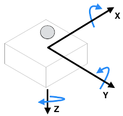

# mpu9250
This library communicates with [InvenSense MPU-9250 and MPU-9255](https://invensense.tdk.com/products/motion-tracking/9-axis/mpu-9250/) Inertial Measurement Units (IMUs).
   * [License](LICENSE.md)
   * [Changelog](CHANGELOG.md)
   * [Contributing guide](CONTRIBUTING.md)

## Installation
CMake is used to build this library, which is exported as a library target called *mpu9250*. The header is added as:

```
#include "mpu9250/mpu9250.h"
```
Note that you'll need CMake version 3.13 or above; it is recommended to build and install CMake from source, directions are located in the [CMake GitLab repository](https://github.com/Kitware/CMake).

The library can be also be compiled stand-alone using the CMake idiom of creating a *build* directory and then, from within that directory issuing:

```
cmake .. -DMCU=MK66FX1M0
make
```

This will build the library, example executables called *i2c_example* and *spi_example*, and executables for testing using the Google Test framework. The example executable source files are located at *examples/i2c.cc* and *examples/spi.cc*. This code is built and tested on an AMD64 system running Linux and is likely to build on AMD64 systems running the Windows Subsystem for Linux (WSL). The [arm-none-eabi](https://developer.arm.com/tools-and-software/open-source-software/developer-tools/gnu-toolchain/gnu-rm/downloads) toolchain must be installed in your Linux environment.

Notice that the *cmake* command includes a define specifying the microcontroller the code is being compiled for. This is required to correctly configure the code, CPU frequency, and compile/linker options. The available MCUs are:
   * MK20DX128
   * MK20DX256
   * MK64FX512
   * MK66FX1M0
   * MKL26Z64

These are known to work with the same packages used in Teensy products. Also switching the MK66FX1M0 or MK64FX512 from BGA to LQFP packages is known to work well. Swapping packages of other chips is probably fine, as long as it's only a package change.

The *i2c_example* and *spi_example* targets create executables for communicating with the sensor using I2C or SPI communication, respectively. Each target also has a *_hex* for creating the hex file and a *_upload* to upload the software to the microcontroller. 

Testing is done using a lightweight Remote Command Protocol (RCP) between a Linux *master* and the microcontroller *slave*. The *slave* registers tests, which the *master* can call and receive a boolean status on the test results. A definition file utility, [mcu_hil_defs](https://gitlab.com/bolderflight/utils/mcu_hil_defs) defines the pins and ports for each sensor and communication method. A seperate utility, *mcu_reset*, cycles power to the microcontroller and sensors to provide a clean environment; it should be used before each test. See *tests/master.cc* and *tests/slave.cc* for how the tests are defined for the Mpu9250.

## Namespace
This library is within the namespace *sensors*.

## Methods

**Mpu9250(i2c_t3 &ast;bus, uint8_t addr)** Creates a Mpu9250 object. This constructor is used for the I2C communication interface. A pointer to the I2C bus object is passed along with the I2C address of the sensor. The address will be 0x68 if the AD0 pin is grounded and 0x69 if the AD0 pin is pulled high.

```C++
sensors::Mpu9250 mpu9250(&Wire, 0x68);
```

**Mpu9250(SPIClass &ast;bus, uint8_t cs)** Creates a Mpu9250 object. This constructor is used for the SPI communication interface. A pointer to the SPI bus object is passed along with the chip select pin of the sensor. Any pin capable of digital I/O can be used as a chip select pin.

```C++
sensors::Mpu9250 mpu9250(&SPI, 2);
```

**bool Begin()** Initializes communication with the sensor and configures the default sensor ranges, sampling rates, and low pass filter settings. The default accelerometer range is +/- 16g and the default gyro range is +/- 2,000 deg/s. The default sampling rate is 1000 Hz and the low-pass filter is set to a cutoff frequency of 184 Hz. True is returned if communication is able to be established with the sensor and configuration completes successfully, otherwise, false is returned.

```C++
bool status = mpu9250.Begin();
if (!status) {
   // ERROR
}
```

**bool EnableDrdyInt()** Enables the data ready interrupt. A 50 us interrupt will be triggered on the MPU-9250 INT pin when IMU data is ready. This interrupt is active high. This method returns true if the interrupt is successfully enabled, otherwise, false is returned.

```C++
bool status = mpu9250.EnableDrdyInt();
if (!status) {
   // ERROR
}
```

**bool DisableDrdyInt()** Disables the data ready interrupt. This method returns true if the interrupt is successfully disabled, otherwise, false is returned.

```C++
bool status = mpu9250.DisableDrdyInt();
if (!status) {
   // ERROR
}
```

**void rotation(Eigen::Matrix3f c)** Applies a rotation matrix to the sensor measurements. The default value for $`c`$ is the identity matrix and the default sensor reference frame is shown below:



Outputs are defined as:

```math
x_{u} = c * x_{b}
```

Where $`x_{u}`$ is the output, $`c`$ is the rotation matrix, and $`x_{b}`$ are the measurements in the sensor reference frame.

**Eigen::Matrix3f rotation()**

**bool accel_range(AccelRange range)**

**AccelRange accel_range()**

**bool gyro_range(GyroRange range)**

**GyroRange gyro_range()**

**bool sample_rate_divider(uint8_t srd)**

**uint8_t sample_rate_divider()**

**bool dlpf_bandwidth(DlpfBandwidth dlpf)**

**DlpfBandwidth dlpf_bandwidth()**

**void DrdyCallback(uint8_t int_pin, void (&ast;function)())**

**bool Read()**

**Imu imu()**

**Temperature die_temperature()**

**Mag mag()**
